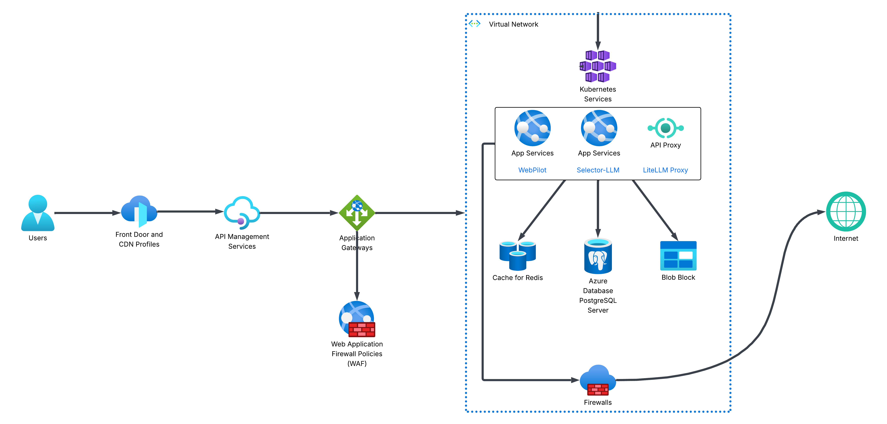

# WebPilot MCP – Agent de Scraping Autonome via IA

Ce projet a été réalisé dans le cadre du test technique pour le poste de **Développeur Full-Stack IA** chez **TW3 Partners**.

Il se compose de deux parties principales :

1.  Un **Serveur MCP** : Construit avec **FastMCP** et **Playwright**, il expose des outils de bas niveau pour contrôler un navigateur (cliquer, naviguer, scraper).
    
2.  Un **Agent IA** : Un agent Python asynchrone qui utilise le serveur MCP pour exécuter des tâches de scraping complexes. Il reçoit un **schéma JSON** en entrée, utilise une IA (via **LiteLLM**) pour générer un plan d'extraction, et pilote le navigateur pour extraire les données. Il est capable d'extraire **plusieurs collections de données** (ex: "tee-shirts", "pantalons" et "avis") en un seul passage, de manière récursive et paginée.
    

----------

## Fonctionnalités principales

### Agent

L'agent est le cœur du projet et gère l'ensemble du processus d'extraction de données.

-   **Analyse IA Dynamique** : Utilise `litellm` pour appeler un LLM afin d'analyser le HTML et de le mapper au schéma JSON fourni par l'utilisateur.
    
-   **Génération de "Map" de Sélecteurs** : Crée dynamiquement une carte JSON de sélecteurs CSS pour _chaque_ champ requis, y compris les champs imbriqués.
    
-   **Scraping Récursif** : Gère les structures de données imbriquées (ex: une `citation` qui contient une _liste_ de `tags`).

- **Scraping Multi-Collection** : Capacité à scraper **plusieurs** types de données (ex: `citations` et `top_tags`, ou `tee-shirts`, `pantalons`, `pulls`) simultanément sur _chaque_ page, au lieu de devoir relancer un script pour chaque item. L'agent scrape tout ce qui est défini dans le schéma avant de passer à la page suivante.
    
-   **Logique "par Page"** : Scrape _toutes_ les collections demandées (ex: `citations` et `top_tags`) sur la page actuelle avant de passer à la suivante.
    
-   **Pagination Automatique** : Détecte et clique sur les boutons "Page Suivante" en utilisant une liste de sélecteurs génériques.
    
-   **Nettoyage & Validation** : Convertit, nettoie et valide automatiquement les données brutes (chaînes, nombres, dates) en fonction du type spécifié dans le schéma.
    
-   **Rapport de Qualité** : Génère un `quality_report` détaillé avec le taux de complétion, les champs manquants et les erreurs pour chaque collection.
    

### Serveur

Le serveur MCP fournit les outils de bas niveau que l'agent utilise pour interagir avec le web.

|**Outil**|**Description**|
| :--------------- |:---------------|
|`tool_navigate(url)`|Ouvre une URL dans le navigateur partagé.
|` tool_click(selector)`|Clique sur un élément cliquable.
|` tool_fill(selector, text)`|Remplit un champ de formulaire.
|`tool_get_html(save_path)`|Récupère le HTML rendu de la page et peut le sauvegarder.
|`tool_scrape_elements(selector, attribute, max_items)`|Extrait le texte ou les attributs d'un ou plusieurs éléments.
|`tool_screenshot(path, full)`|Prend une capture d’écran. On peut spécifier si on souhaite toute la page.
|` tool_scroll(direction, amount, px)`|Fait défiler la page dans la direction souhaitée et du nombre de pixels souhaités.
|`tool_extract_links(contains)`|Extrait tous les liens de la page. On peut filtrer par lien contenant un mot spécifique.

----------

## Architecture du projet

Le projet est divisé en deux modules principaux : le **Serveur** (`src/webpilot`) et l'**Agent** (`agent/`). L'agent est conçu de manière modulaire pour séparer les responsabilités.

### Agent (`agent/`)

-   `main.py`: Point d'entrée principal. Orchestre la logique de scraping par page.

-   `client.py`: Gère la connexion et la communication avec le serveur MCP.
    
-   `config.py`: Charge et valide le fichier `input.json` (URL, schéma, options).
    
-   `llm_map.py`: Construit le prompt dynamique, appelle le LLM (via `litellm`), et renvoie la carte des sélecteurs css.
    
-   `scraper.py`: Contient la logique de scraping récursive (`_scrape_item_recursive`) qui gère l'imbrication.
    
-   `pagination.py`: Gère la détection et le clic sur le bouton "Page Suivante".
    
-   `flow.py`: Gère l'exécution des interactions utilisateur (clics, remplissage de formulaires) avant le scraping.
    
-   `processing.py`: Contient toute la logique de nettoyage (`clean_item_data`) et de conversion de types (`convert_value`).
    
-   `reporting.py`: Construit le `output.json` final.
    

### Serveur (`src/webpilot/`)

-   `server.py`: Le serveur FastMCP qui expose les outils via `stdio`.
    
-   `tools.py`: L'implémentation Playwright de chaque outil.
    
-   `browser.py`: Gère le démarrage et l'arrêt du navigateur Playwright.
    

----------

## Installation et Exécution

### 1. Variables d'Environnement

Ce projet utilise **LiteLLM** pour se connecter à un service d'IA. Vous devez fournir votre clé API. Je recommande d'utiliser Groq. L'agent est fait de manière à d'analyser le HTML à _chaque chargement de page_. La vitesse d'inférence est donc cruciale. Groq utilise des LPU pour fournir des modèles à une vitesse quasi-instantanée, ce qui rend l'agent extrêmement réactif.

Créez un fichier `.env` à la racine du projet :

Extrait de code

```
# Exemple pour Groq
GROQ_API_KEY=sk-VotreCleApiIci

```

### 2. Installation
Ce projet utilise `uv` pour la gestion de l'environnement et des dépendances, car il est extrêmement rapide.
Si vous n'avez pas uv, vous pouvez l'installer en suivant les instructions officielles : https://docs.astral.sh/uv/getting-started/installation/
La méthode la plus simple est souvent via pip :

**Une fois `uv` installé :**

Bash

```
# 1. Installer les dépendances Python (dont mcp, playwright, litellm)
uv sync

# 2. Installer le navigateur Chromium pour Playwright
uv run playwright install chromium

```

### 3. Exécution de l'Agent

L'agent pilote tout. Il démarre le serveur MCP en arrière-plan et s'y connecte.

Bash

```
# Syntaxe :
# uv run python agent/agent.py [chemin_serveur] [input.json] [output.json]

```

### 4. Fichiers

-   `agent/input.json`: Fichier d'exemple d'input. Modifiez-le pour définir le site et le schéma que vous souhaitez scraper.
    
-   `output.json`: Le fichier de sortie contenant les données extraites et le rapport de qualité.
    

----------

## Stack Technique

-   **Python 3.10+**
    
-   **Agent (IA)**: `litellm` (pour les appels LLM), `python-dotenv` (gestion des clés)
    
-   **Serveur (Outils)**: `Playwright` (contrôle du navigateur), `mcp[cli]` (protocole de communication)
    
-   **Gestion de projet**: `uv` (gestion des dépendances et de l'environnement)


# Architecture Cloud Azure – Présentation & Justification

Cette architecture a été conçue pour respecter trois consignes :

-   **Un SLA de 99.9%**,
    
-   **Une scalabilité jusqu’à 1000 utilisateurs en même temps**,
    
-   **Une conformité stricte (RGPD, ISO 27001, audit mensuel, traçabilité)**.
    

Elle repose sur un modèle de **microservices** déployés dans **Azure Kubernetes Service (AKS)** et protégés par une **isolation réseau via Azure Virtual Network (VNet)**.

# Services Azure utilisés
-   **Azure Front Door**

-   **Azure API Management (APIM)**

-   **Azure Application Gateway (WAF)**

-   **Azure Virtual Network (VNet)**

-   **Azure Kubernetes Service (AKS)**

-   **Azure Firewall + IP Pool**

-   **Azure Cache for Redis**

-   **Azure PostgreSQL**

-   **Azure Blob Storage**

-   **Azure Key Vault**

-   **Azure Service Bus**

-   **Azure Monitor + Log Analytics**

-   **Microsoft Sentinel**



# 1. Vue d’ensemble du flux utilisateur

Le parcours d’une requête dans WebPilot suit un flux en plusieurs couches, chacun ayant un rôle de sécurité ou de performance.

### **1) Entrée utilisateur**

**Azure Front Door** est le point d’entrée global.  
Il s'assure de la répartition du trafic, de la disponibilité du service et d'une reprise facile en cas de panne.

### **2) Vérification & conformité**

**Azure API Management (APIM)** applique les règles importantes, comme l'authentification, la limitation du débit, la lecture du _robots.txt_ pour vérifier si l'on est autorisé à aller sur ce site web.

### **3) Protection anti-attaques**

**Application Gateway équipée du WAF** filtre les requêtes HTTP et bloque les attaques. 

### **4) Réseau privé**

**Azure Virtual Network (VNet)** contient tous les composants sensibles pour les isoler dans un réseau privé.


----------

# 2. Exécution du scraping & de l’IA – Azure Kubernetes Service (AKS)

**AKS** héberge les 3 micro-services du projet :

- **WebPilot (Playwright)** ouvre les pages, clique, scroll, extrait le HTML, etc... Il fait toutes les actions d'un utilisateurs sur un navigateur
- **Selector-LLM Service** analyse le HTML via un appel à un LLM et renvoie les sélecteurs correspondants à la demande

- **LiteLLM Proxy** gère les appels vers Groq en utilisant la clé API, et en gérant le cache, les limites, les coûts, etc...


AKS est l’endroit où se passe réellement le script du projet. De plus il permet un auto-scaling pour gérer les pics d'utilisateurs.

----------

# 3. Services internes au VNet : Performance & Données

- **Azure Cache for Redis** est un cache partagé qui stocke robots.txt, les réponses LLM, le HTML, etc... Afin de réduire la latence 
- **Azure PostgreSQL** est une Base de Données qui sauvegarde l'historique, les utilisateurs, les metadonnées, etc... Toutes les informations utiles dans le temps.
- **Azure Blob Storage** stocke les fichiers lourds comme le HTML, les captures d'écran, les fichiers, etc...

- **Azure Key Vault** protège les fichiers et données sensibles comme la clé API, les certificats, et les clés de chiffrement

Ces services sont accessibles uniquement via des Private Endpoints.

----------

# 4. Sortie Internet contrôlée – Azure Firewall + Rotation d’IP

Pour respecter les politiques strictes sur le scraping, le navigateur _Playwright_ est le seul composant autorisé à sortir du **VNet**. Et il ne peut sortir que via **Azure Firewall**. Le firewall permet de filtrer les domaines autorisés, changer d'IP via un pool et surtout d'avoir une vue d'ensemble des sorties. Cela permet finalement d'éviter des blocages.

----------

# 5. Gestion des pics de charge – Azure Service Bus

Si il y a beaucoup de requêtes (le pic de 1000 utilisateurs), **Azure Service Bus** propose une file d'attente. Les requêtes sont mises dans une queue. Ensuite les micro-services les gèrent une par une.

----------

# 6. Observabilité & Audit – Azure Monitor + Sentinel

- **Azure Monitor + Log Analytics** centralise les logs de tous les outils comme l'APIM, le AKS, le Firewall, etc...
- **Microsoft Sentinel** analyse les logs de Monitor et tente de détecter les anomalies, lève des alertes, automatise des rapports de conformité (ISO 27001 et RGPD).

----------

# Résumé 

Cette architecture prpose de la sécurité, de la performance et respecte les conformités.  
Le trafic est filtré et validé dès l’entrée (Front Door, APIM, WAF) avant d’être isolé dans un réseau privé (VNet).  
L’exécution du scraping et du traitement IA se déroule dans AKS, qui est capable de s’adapter automatiquement à la surcharge d'utilisateurs via l’auto-scaling.  
Les données sont stockées dans des services sécurisés (Redis, PostgreSQL, Blob) accessibles via Private Endpoints, et les sorties Internet sont contrôlées par le firewall.  
Puis, le tout est contrôlé par Monitor et Sentinel qui offrent une traçabilité complète et un respect des normes RGPD et ISO 27001.


## Analyse et Améliorations Possibles

L'agent fonctionne très bien, mais le scraping à grande échelle nécessite de gérer deux défis : la fiabilité de l'IA et les mesures anti-bot.

### 1. Fiabilité de l'IA (Sélecteurs CSS)

-   **Problème :** L'IA peut "halluciner" et fournir des sélecteurs fragiles (`div:nth-child(3)`) sur des sites complexes.
    
-   **Solutions :**
    
    -   **Auto-Correction (Self-Healing) :** Si un sélecteur échoue (`null` ou `[]`), l'agent pourrait automatiquement redemander à l'IA un _nouveau_ sélecteur pour ce champ spécifique. Mais cela rajoute des coûts d'utilisation.
        
    -   **Vision (Multimodal) :** Utiliser un `screenshot` avec le `HTML` et un modèle **vision** pour trouver les sélecteurs visuellement, ce qui est souvent plus fiable que l'analyse de HTML.
        

### 2. Protections Anti-Scraping

-   **Problème :** La plupart des sites bloquent les scripts.
    
-   **Solutions :**
    
    -   **Rotation de Proxy :** Utiliser des services de proxy pour que chaque requête vienne d'une IP différente.
        
    -   **Résolveurs de CAPTCHA :** Détecter les CAPTCHAs et envoyer l'image à un service tiers pour résolution avant de `remplir` le formulaire.
        
    -   **"Humanisation" :** Ajouter des délais aléatoires et simuler des mouvements de souris avant de `cliquer` pour paraître moins robotique.

